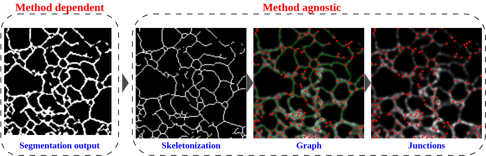

# nERdy
This repository provides code for training, inference of endoplasmic reticulum segmentation method nERdy+, and the analysis of the dynamics presented in the paper nERdy: network analysis of endoplasmic reticulum dynamics.

## network analysis of endoplasmic reticulum dynamics with image processing and deep learning methods
Ashwin Samudre, Guang Gao, Ben Cardoen, Ivan Robert Nabi, Ghassan Hamarneh

Pre-print: [https://www.biorxiv.org/content/10.1101/2022.05.17.492189v1](https://www.biorxiv.org/content/10.1101/2024.02.20.581259v1.abstract)

## Abstract
The endoplasmic reticulum (ER) comprises smooth tubules, ribosome-studded sheets, and peripheral sheets that can present as tubular matrices. ER shaping proteins determine ER morphology, however, their role in tubular matrix formation requires reconstructing the dynamic, convoluted ER network. Existing reconstruction methods are sensitive to parameters or require extensive annotation and training for deep learning. We introduce nERdy, an image processing based approach, and nERdy+, a D4-equivariant neural network, for accurate extraction and representation of ER networks and junction dynamics, outperforming previous methods. Comparison of stable and dynamic representations of the extracted ER structure reports on tripartite junction movement and distinguishes tubular matrices from peripheral ER networks. Analysis of live cell confocal and STED time series data shows that Atlastin and Reticulon 4 promote dynamic tubular matrix formation and enhance junction dynamics, identifying novel roles for these ER-shaping proteins in regulating ER structure and dynamics.


In the figure above, `A` shows the nERdy method, and `B` shows the nERdy+ method.

## Data
The tiff files for the confocal modality can be downloaded from [here](https://figshare.com/articles/dataset/nERdy_dataset/25241458).

## nERdy: Image processing method
nERdy provides a set of morphological image processing operations for the segmentation of tubular structures from the input ER samples.

## nERdy for custom dataset
To use nERdy as a simple baseline on your custom dataset, simply provide the path of the input image file, and nERdy saves the segmentation output in the same path as the input file path. The morphological image processing parameters can be tuned as per the requirements of your custom data.

## nERdy+: D4-equivariant segmentation method
nERdy+ is a D4-equivariant encoder-decoder network trained to segment the tubular structures from input ER samples.

## Training nERdy+ on custom dataset
Data: In your data directory store the `images` and `masks` in individual subdirectories. Masks are expected to have the same name as the corresponding input image followed by a `_mask` suffix.

Trainer: provide the data path and set other hyperparameters in the config.ini file and run `train.py`

Inference: provide the saved model path in `inference.py` to obtain the output segmentation map.

## Analysis framework: scripts for junction analysis pipeline and to generate all the results in the paper
`junction_analysis` script provides the routines for dynamics analysis presented in the paper. Our dynamic analysis framework is method-agnostic and can be plugged with other methods for segmentation apart from nERdy+.



## Cite
If you find this article useful, please cite
```
@article{samudre2024nerdy,
  title={nERdy: network analysis of endoplasmic reticulum dynamics},
  author={Samudre, Ashwin and Gao, Guang and Cardoen, Ben and Nabi, Ivan Robert and Hamarneh, Ghassan},
  journal={bioRxiv},
  pages={2024--02},
  year={2024},
  publisher={Cold Spring Harbor Laboratory}
}
```
